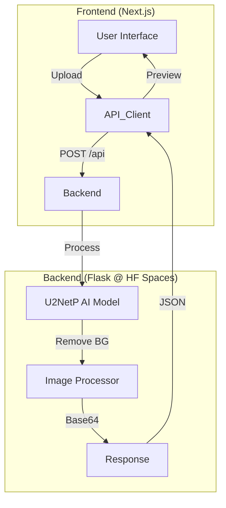

<div align="center">

# Novalens - AI Background Remover


[](CONTRIBUTING.md)

**A professional, AI-powered tool to remove image backgrounds in seconds.**
Built with **Next.js 15** (Frontend) and **Flask** (Backend) running on **Hugging Face Spaces**.

[🎥 Live Demo](https://yashnaiduu-novalens-backend.hf.space) · [🐛 Report Bug](https://github.com/yashnaiduu/Novalens/issues) · [✨ Request Feature](https://github.com/yashnaiduu/Novalens/issues)

</div>

---

## 📚 Table of Contents

- [Features](#-features)
- [Architecture](#-architecture)
- [Quick Start](#-quick-start)
- [Deployment](#-deployment)
- [Troubleshooting](#-troubleshooting)
- [Contributing](#-contributing)
- [License](#-license)

## ✨ Features

- **🎯 Instant AI Removal**: Powered by `u2netp` (lightweight & fast) and `rembg`.
- **🎨 Smart Editor**: Drag & drop interface with Before/After comparison.
- **⚡ Super Fast**: Optimized with global session caching for <1s processing.
- **🔒 Secure & Private**: Images are processed in memory and never stored.
- **📱 Responsive UI**: Beautiful dark/light mode interface built with Tailwind CSS.

## 🏗️ Architecture



## 🚀 Quick Start

### Prerequisites

- Node.js 18+
- Python 3.11+

### Installation

1.  **Clone the repo**
    ```bash
    git clone https://github.com/yashnaiduu/Novalens.git
    cd Novalens
    ```

2.  **Backend Setup**
    ```bash
    python3 -m venv venv
    source venv/bin/activate
    pip install -r requirements.txt
    python3 app.py
    ```

3.  **Frontend Setup**
    ```bash
    cd next-frontend
    npm install
    npm run dev
    ```

4.  **Open App**
    Visit `http://localhost:3000`.

## ☁️ Deployment

### Backend (Hugging Face Spaces)

This project is configured for **Hugging Face Spaces** (Docker SDK).

[](https://huggingface.co/new-space?template=yashnaiduu/Novalens)

1.  Click the button above.
2.  Select **Docker** as the SDK.
3.  Choose the free tier (16GB RAM).
4.  Deploy!

### Frontend (Vercel)

Deploy the `next-frontend` directory to Vercel. Set the environment variable:
`NEXT_PUBLIC_API_BASE=https://your-space-name.hf.space`

## 🔧 Troubleshooting

| Issue | Solution |
|-------|----------|
| **404 Not Found** | Ensure the backend URL in `NEXT_PUBLIC_API_BASE` is correct (no trailing slash). |
| **500 Internal Server Error** | Check backend logs. If using local, ensure `rembg` is installed. |
| **Memory Error** | Upgrade to `u2netp` model (default in this repo) or use a machine with >4GB RAM. |
| **CORS Error** | Ensure backend allows origins from your frontend domain (handled in `app.py`). |

## 🤝 Contributing

We welcome contributions! Please see our [CONTRIBUTING.md](CONTRIBUTING.md) for details on how to get started.

## 📄 License

This project is licensed under the MIT License - see the [LICENSE](LICENSE) file for details.

---

<div align="center">
Made with ❤️ by Yash Naidu · <a href="https://github.com/yashnaiduu">GitHub</a> · <a href="https://twitter.com/yourhandle">Twitter</a>
</div>
